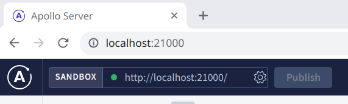

# Authorisation example

This package provides a template for setting up authorisation in your GraphQL application. 

## Running the code

1. Start the application by running the following commands in the `packages/authorization` directory:

```shell
# Install the packages
(cd ../..; pnpm install)

# Start the database service
(cd ../..; pnpm services:up)

# Set up the database tables
pnpm db:init

# Start the application
pnpm dev
```

2. Navigate your browser to [the app page](http://localhost:21000)
3. Click on the gear icon in the top left of the screen: 
4. In the dialog that appears, turn on the `Include cookies` option
5. Click the `Save` button
6. To log in, run the `login` mutation:
```graphql
mutation login {
    login(input: { email: "admin@site.com", password: "abc123" }) {
        id
        name
        email
    }
}
```

7. Play around with the various queries and mutations defined in [schema.gql](./src/services/gateway/graphql/schema.gql)

The foll list of available users is available in [users.ts](./src/fixtures/users.ts). All users (apart from ones you create with the `registerUser` mutation) have the password of "abc123"

## Permissions model

All of the permissions-related code is defined in [services/auth](./src/services/auth). Specifically, the permissions each role confers are defined in [organization.ts](./src/services/auth/permissions/organization.ts) and [team.ts](./src/services/auth/permissions/team.ts). 

Post permissions are more complex and depend on the post itself (particularly whether the post has been published or not and who it has been shared with). You can find the code for determining a post's permissions in [PostPermissionsHelper.ts](./src/services/auth/helpers/PostPermissionsHelper.ts).

Since all of the permissions and access control filters are defined in the auth service, you can change the rules as you see fit and the rest of the application will follow them.

## General design

This application follows the modular monolith design, and is divided up into two services:
* [auth](./src/services/auth): Responsible for deciding at a user can do
* [gateway](./src/services/gateway): Responsible for providing the app's HTTP server and GraphQL interface

At the start of each GraphQL request, the `auth` service is asked to provide the permission list, `can()` function and database filters for the user that made the request. These are added to the request context so that resolvers can safely filter queries and check permissions as needed. 

### can() function

This function is provided with a permission (eg `TeamPermission.CREATE_POST`) and an object or ID and returns `true` if the user should be allowed to perform this action or `false` otherwise. 

### filters

These are a set of Prisma filters that should be added to any database queries so that the user is not sent any objects (teams, posts etc) that they would otherwise be unable to view 
